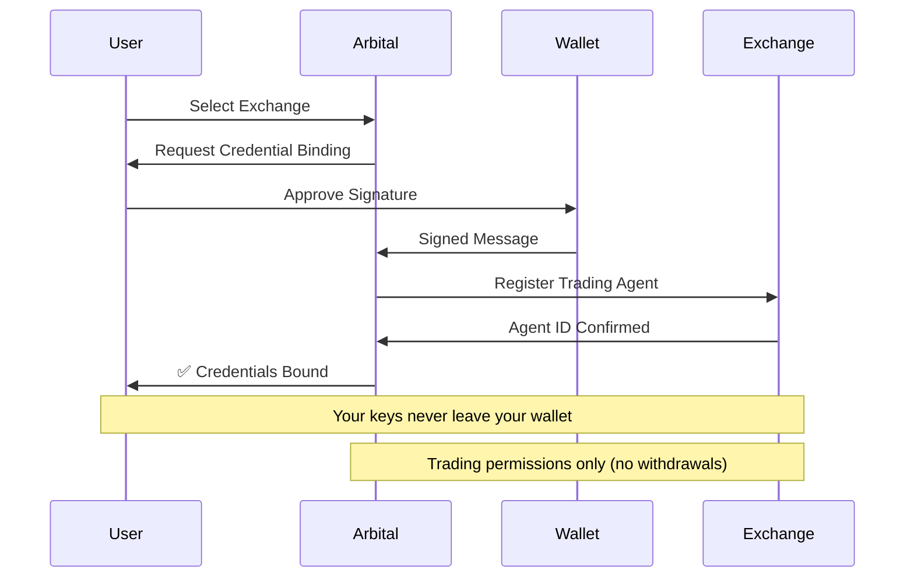

# Connect Wallet

Arbital uses wallet-based authentication — no email or password required.

## How Authentication Works

Arbital uses **non-custodial authentication**:

1. You connect your wallet
2. Sign a challenge message (not a transaction)
3. The signature proves you own the wallet
4. A session is created for your browser

**Security:** Your private keys never leave your wallet. No transactions are sent. No tokens are spent.

## Supported Wallets

### EVM Wallets (for Extended)

| Wallet | Type | Recommended |
|--------|------|-------------|
| **MetaMask** | Browser extension | <i class="fa-circle-check">:circle-check:</i> Most popular |
| **Rainbow** | Mobile + Extension | Great UX |
| **WalletConnect** | Mobile bridge | Any WC-compatible wallet |
| **Coinbase Wallet** | Browser + Mobile | Easy onboarding |
| **Rabby** | Browser extension | Multi-chain support |

### Solana Wallets (for Pacifica)

| Wallet | Type | Recommended |
|--------|------|-------------|
| **Phantom** | Browser + Mobile | <i class="fa-circle-check">:circle-check:</i> Most popular |
| **Solflare** | Browser + Mobile | Feature-rich |
| **Backpack** | Browser extension | xNFT support |


**Need detailed setup help?** See our wallet-specific guides:
- [MetaMask Setup Guide](wallets/metamask.md)
- [Phantom Setup Guide](wallets/phantom.md)
- [Ledger Hardware Wallet Guide](wallets/ledger.md)


## Connection Steps

### First Time Setup

1. **Visit** [arbital.xyz](https://arbital.xyz)
2. **Click** "Connect Wallet"
3. **Select** your wallet from the list
4. **Approve** the connection in your wallet popup
5. **Sign** the authentication message
   - This is a text message, not a transaction
   - No gas fees required
   - Message includes a timestamp for security
6. **Enter invite code** if prompted (beta access)
7. **Done** — you're now logged in

### EIP-712 Typed Data Signing

For EVM wallets, Arbital uses EIP-712 typed data signing:

```
Domain: arbital.xyz
Message: "Sign this message to authenticate with Arbital"
Timestamp: [current time]
Wallet: [your address]
```

This standard:
- Shows you exactly what you're signing
- Cannot be replayed (timestamp-bound)
- Is widely supported by all major wallets

### Solana Message Signing

For Solana wallets, you sign a simple text message:
- Message includes your wallet address
- Timestamp prevents replay attacks
- Standard Solana signing flow

## Managing Your Session

### Session Duration

- Sessions last until you disconnect or clear cookies
- Automatic refresh keeps you logged in
- Multiple browser tabs share the same session

### Switching Wallets

1. Click your wallet address in the navbar
2. Click **Disconnect**
3. Connect with a different wallet
4. Each wallet address has its own bots and history

### Security Tips

- **Lock your wallet** when not actively using Arbital
- **Review signatures** before approving
- **Never share** your seed phrase with anyone
- **Use hardware wallets** for large balances

## Exchange Credential Binding

After connecting your wallet, you'll bind exchange credentials:



### For Pacifica (Solana)
1. Select Pacifica as your exchange
2. Approve referral (sign message)
3. Verify $20+ balance
4. Create credentials (sign message)
5. Agent bound to your wallet

### For Extended (EVM)
1. Select Extended as your exchange
2. Click "Create Credentials"
3. Sign the binding message
4. Verify $20+ balance
5. Credentials linked to your wallet

## Troubleshooting

### Wallet Not Connecting

1. **Unlock your wallet** — ensure it's not locked
2. **Check the popup** — it may be behind other windows
3. **Refresh the page** — and try again
4. **Try another browser** — some extensions conflict
5. **Disable other wallet extensions** — temporarily

### Signature Request Not Appearing

1. **Check your wallet** — popup may be minimized
2. **Click the wallet icon** — in your browser toolbar
3. **Refresh** — and reconnect

### Wrong Network Warning

- Arbital auto-detects the appropriate network
- Your wallet doesn't need to be on a specific chain
- The signature works on any network

### Already Connected But Shows Disconnected

1. **Clear cookies** for arbital.xyz
2. **Reconnect** your wallet
3. **Sign** the authentication message again

## Multiple Accounts

- Each wallet address = separate Arbital account
- Bots and settings don't transfer between wallets
- Switch wallets to access different accounts

---

*Last updated: 2026-02-03*
