# Bot Configuration

Fine-tune your Arbital bot for optimal performance.

## 🎬 Video: Grid vs TWAP Strategy


**Coming Soon** — A side-by-side comparison video explaining when to use each strategy is being created.


<!-- Video embed placeholder - replace with YouTube/Loom when ready:

-->

## Strategy Types

Arbital supports two market-making strategies:

### TWAP (Time-Weighted Average Price)

Spreads orders over time to reduce market impact. Best for consistent execution.

**Use when:**
- You want steady, predictable execution
- Trading larger positions
- Market conditions are relatively stable

### Grid Market Maker

Places orders at fixed price intervals to profit from oscillation. Best for ranging markets.

**Use when:**
- Price is expected to oscillate within a range
- You want to capture small price movements
- Market is not trending strongly

### Strategy Comparison

```mermaid
flowchart LR
    subgraph TWAP["📈 TWAP Strategy"]
        T1[Continuous Orders]
        T2[Time-Based Execution]
        T3[Auto Inventory Mgmt]
    end

    subgraph Grid["📊 Grid Strategy"]
        G1[Fixed Price Levels]
        G2[Range-Bound Trading]
        G3[Defined Profit/Fill]
    end

    subgraph When["When to Use"]
        TW[/"Trending or<br/>Unknown Markets"/]
        GW[/"Ranging or<br/>Sideways Markets"/]
    end

    TWAP --> TW
    Grid --> GW
```



| Aspect | TWAP | Grid |
|--------|------|------|
| **Order Placement** | Continuous, time-weighted | Fixed price intervals |
| **Best Market** | Any condition | Ranging/sideways |
| **Profit Source** | Spread + volume | Price oscillation |
| **Risk Profile** | Lower (auto-manages) | Higher (boundary stops) |
| **Capital Efficiency** | Moderate | High in range |

## Core Parameters

### Notional (TWAP)

The total USD value to trade, split between buy and sell orders (unless biased).

| Setting | Description |
|---------|-------------|
| Small ($100-500) | Lower risk, suitable for testing |
| Medium ($500-2000) | Balanced approach |
| Large ($2000+) | Higher volume, more reward potential |

### Bias

Directional preference from -1 (full short) to +1 (full long).

| Bias | Value | Behavior |
|------|-------|----------|
| **Short** | -1.0 | 100% sell orders, profits from price drops |
| **Slight Short** | -0.5 | 75% sell, 25% buy |
| **Neutral** | 0 | 50% buy, 50% sell (delta-neutral) |
| **Slight Long** | +0.5 | 75% buy, 25% sell |
| **Long** | +1.0 | 100% buy orders, profits from price increases |

**Margin Impact:** Higher bias increases margin requirement by up to 20%.

## Execution Modes

Control how frequently your bot refreshes orders:

| Mode | Refresh Interval | Spread Offset | Max Skew Offset | Best For |
|------|------------------|---------------|-----------------|----------|
| **Aggressive** | 3 seconds | 0.1 bps | 5 bps | High-volatility, rapid response |
| **Normal** | 5 seconds | 0.2 bps | 10 bps | Standard operation |
| **Passive** | 7 seconds | 0.4 bps | 15 bps | Low-volatility, cost savings |

**Trade-offs:**
- More aggressive = faster response but higher gas/fees
- More passive = lower costs but slower adaptation

## Inventory Management

Control your position exposure to manage risk.

### Max Inventory (USD)

Hard limit on directional exposure. When reached:
- **At max long:** Bot only places sell orders
- **At max short:** Bot only places buy orders

| Setting | Range | Use Case |
|---------|-------|----------|
| Conservative | $100-500 | Lower risk, tighter control |
| Moderate | $500-2000 | Balanced approach |
| Aggressive | $2000+ | Higher exposure tolerance |

**Default:** $2,000 USD

### Inventory Skew Factor

How aggressively the bot rebalances when inventory builds up.

| Factor | Behavior |
|--------|----------|
| **0%** | No adjustment (50/50 buy/sell regardless of inventory) |
| **30%** | Lazy drift (Passive mode default) |
| **50%** | Moderate rebalancing (Normal mode default) |
| **70%** | Strong rebalancing (Aggressive mode default) |
| **100%** | Full adjustment (0% on one side at max inventory) |

## Grid Strategy Parameters

For Grid Market Maker strategy:

| Parameter | Range | Description |
|-----------|-------|-------------|
| **Levels per Side** | 1-20 | Number of buy/sell orders on each side |
| **Spacing (%)** | 0.1-10% | Price distance between grid levels |
| **Order Size (USD)** | Up to $100,000 | USD per order per level |
| **Boundary (%)** | 0.5-50% | Stop-loss trigger distance from start price |

**Total Capital Required:** `order_size × levels_per_side × 2`

### Grid Presets

**Tight Grid (ranging markets):**
```
Levels: 8 per side
Spacing: 0.25%
Order Size: $50
Boundary: 2%
Capital Needed: $800
```

**Wide Grid (volatile markets):**
```
Levels: 5 per side
Spacing: 1.0%
Order Size: $200
Boundary: 5%
Capital Needed: $2,000
```

## Configuration Examples

### Conservative TWAP
```
Notional: $500
Bias: 0 (Neutral)
Mode: Passive
Max Inventory: $500
Skew Factor: 30%
```

### Balanced TWAP
```
Notional: $1,500
Bias: 0 (Neutral)
Mode: Normal
Max Inventory: $2,000
Skew Factor: 50%
```

### Aggressive TWAP
```
Notional: $5,000
Bias: 0 (Neutral)
Mode: Aggressive
Max Inventory: $2,000
Skew Factor: 70%
```

### Directional Long
```
Notional: $2,000
Bias: +0.5 (Slight Long)
Mode: Normal
Max Inventory: $3,000
Skew Factor: 50%
```

## Editing Configuration

Bot configuration can only be modified when the bot is in certain states:

| State | Can Edit? |
|-------|-----------|
| Idle | Yes |
| Stopped | Yes |
| Failed | Yes |
| Completed | No (create new bot) |
| Pending | No |
| Running | No (stop first) |
| Stopping | No |

**To edit a running bot:**
1. Stop the bot from the dashboard
2. Wait for status to change to "Stopped"
3. Click **Edit Configuration**
4. Modify parameters
5. Start the bot again

## Validation Rules

### TWAP Validation
- Notional: Required, must be > 0
- Mode: Must be "aggressive", "normal", or "passive"
- Bias: Must be between -1.0 and +1.0
- Budget: Must be between $0 and $1,000,000
- Max Inventory: Must be between $0 and $100,000
- Skew Factor: Must be between 0.0 and 1.0

### Grid Validation
- Levels per Side: 1-20
- Spacing: 0.1% to 10%
- Order Size: > $0 and ≤ $100,000
- Boundary: 0.5% to 50%
- Max Duration: ≥ 60 seconds (if set)

---

*Last updated: 2026-02-02*
