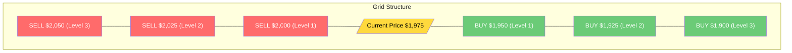

# Grid Strategy Guide

A comprehensive guide to the Grid Market Maker strategy.

## What is Grid Trading?

Grid trading places buy and sell orders at preset price intervals, creating a "grid" of orders. When price oscillates within the grid, orders fill and you profit from the spread.



## How It Works

1. **Setup:** Bot places buy orders below current price, sell orders above
2. **Buy Fill:** When price drops, buy order fills → you accumulate position
3. **Sell Fill:** When price rises, sell order fills → you close position
4. **Repeat:** Grid rebuilds, capturing profits from oscillation

### Profit Calculation

**Per Round Trip:**
```
Profit = Spacing × Order Size - Fees
```

**Example:**
- Spacing: 0.5%
- Order Size: $100
- Fees: 0.04%

```
Profit = (0.5% × $100) - (0.04% × $100 × 2)
       = $0.50 - $0.08
       = $0.42 per round trip
```

## Configuration Parameters

### Levels per Side

Number of buy and sell orders on each side of current price.

| Setting | Orders | Capital Required | Use Case |
|---------|--------|------------------|----------|
| 1-3 | 2-6 total | Low | Conservative, small range |
| 4-7 | 8-14 total | Medium | Balanced approach |
| 8-20 | 16-40 total | High | Wide coverage, volatile markets |

### Spacing Percentage

Price distance between each grid level.

| Spacing | Profit per Fill | Fill Frequency | Best For |
|---------|-----------------|----------------|----------|
| 0.1-0.3% | Low | High | Stable, tight range markets |
| 0.3-0.7% | Medium | Medium | Most conditions |
| 0.7-1.5% | High | Low | Volatile markets |
| 1.5%+ | Very High | Very Low | Extreme volatility |

### Order Size (USD)

How much capital per order.

**Considerations:**
- Larger orders = more profit per fill, but more capital tied up
- Smaller orders = more flexibility, less exposure per level
- Exchange minimum order sizes apply ($10 on Pacifica)

**Recommended:**
```
Order Size = Total Budget ÷ (Levels × 2) ÷ 2
```
This keeps 50% in reserve for position management.

### Boundary Percentage

Stop-loss trigger distance from starting price.

| Boundary | Protection | Grid Range | Trade-off |
|----------|------------|------------|-----------|
| 1-2% | Tight | Narrow | Quick stops, may miss recovery |
| 3-5% | Medium | Standard | Balanced protection |
| 5-10% | Wide | Large | More room, higher max loss |

When price moves beyond boundary:
- All orders cancelled
- Position closed (if possible)
- Bot stops with status `StoppedUpperBoundary` or `StoppedLowerBoundary`

## Preset Configurations

### Tight Grid (Ranging Markets)

For markets expected to stay in a narrow range.

```
Levels per Side: 8
Spacing: 0.25%
Order Size: $50
Boundary: 2%
─────────────────
Total Capital: $800
Grid Width: 4% (8 × 0.25% × 2 sides)
Expected Profit: $0.10 per round trip
```

**Best for:**
- Stable pairs (BTC, ETH)
- Low volatility periods
- Accumulating many small profits

### Wide Grid (Volatile Markets)

For markets with larger price swings.

```
Levels per Side: 5
Spacing: 1.0%
Order Size: $200
Boundary: 5%
─────────────────
Total Capital: $2,000
Grid Width: 10% (5 × 1.0% × 2 sides)
Expected Profit: $1.80 per round trip
```

**Best for:**
- Altcoins with higher volatility
- News-driven markets
- Larger swing opportunities

### Balanced Grid

Middle ground for most market conditions.

```
Levels per Side: 6
Spacing: 0.5%
Order Size: $100
Boundary: 3%
─────────────────
Total Capital: $1,200
Grid Width: 6%
Expected Profit: $0.42 per round trip
```

## Grid vs TWAP: When to Use Each

| Factor | Grid | TWAP |
|--------|------|------|
| **Market Condition** | Ranging/oscillating | Any direction |
| **Profit Source** | Price oscillation | Spread capture |
| **Position Risk** | Can accumulate | Managed by inventory |
| **Complexity** | More parameters | Simpler |
| **Best For** | Predictable ranges | Continuous market making |

**Choose Grid when:**
- Price has been oscillating in a range
- You have a view on support/resistance levels
- You want defined profit targets per fill

**Choose TWAP when:**
- You want continuous market making
- No strong view on price range
- You prefer automatic inventory management

## Risk Management

### Inventory Accumulation

Grid trading can accumulate significant positions:
- If price trends down: accumulates long
- If price trends up: accumulates short (if short-selling)

**Mitigation:**
- Use boundaries to limit exposure
- Monitor position size
- Consider bias settings if trending

### Boundary Hits

When price hits boundary, the grid stops. This protects against:
- Unlimited losses in trending markets
- Holding large positions in unfavorable direction

**After Boundary Stop:**
1. Review why boundary was hit
2. Assess if range assumption was wrong
3. Adjust grid parameters if restarting

### Capital Efficiency

Grid trading ties up capital across multiple levels:
```
Capital Locked = Order Size × Levels × 2
```

Plus margin for positions that fill.

**Optimize by:**
- Using only necessary levels
- Keeping reserve for position margin
- Monitoring utilization

## Monitoring Your Grid

### Key Metrics

| Metric | What It Shows |
|--------|---------------|
| **Round Trips** | Completed buy→sell cycles |
| **Gross Profit** | Total profit from fills |
| **Fees Paid** | Exchange and Arbital fees |
| **Net Profit** | Gross - Fees |
| **Max Drawdown** | Largest unrealized loss |

### Warning Signs

- **No fills for extended time:** Grid might be too wide
- **All buys or all sells:** Price trending, approaching boundary
- **High fees vs profit:** Spacing might be too tight

## Tips for Success

1. **Match grid to market:**
   - Check historical volatility
   - Identify support/resistance levels
   - Set boundaries just beyond normal range

2. **Start conservative:**
   - Use smaller order sizes initially
   - Run for a day to observe behavior
   - Adjust based on actual fills

3. **Monitor regularly:**
   - Check position accumulation
   - Watch for boundary approach
   - Adjust if market conditions change

4. **Account for fees:**
   - Ensure spacing > total fees (both sides)
   - Factor Arbital + exchange fees
   - Wider spacing = more profitable fills

5. **Don't fight trends:**
   - Grid works best in ranging markets
   - If market starts trending, let boundary stop protect you
   - Re-evaluate before restarting
