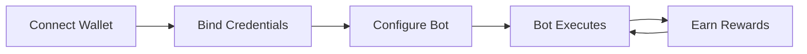
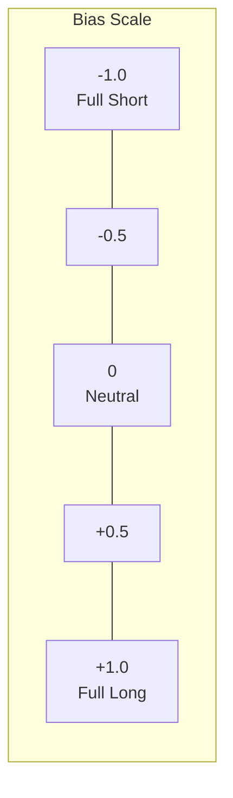
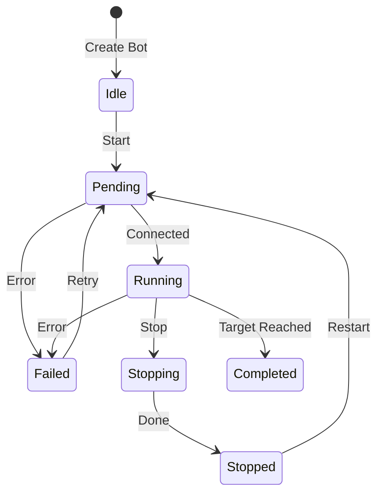
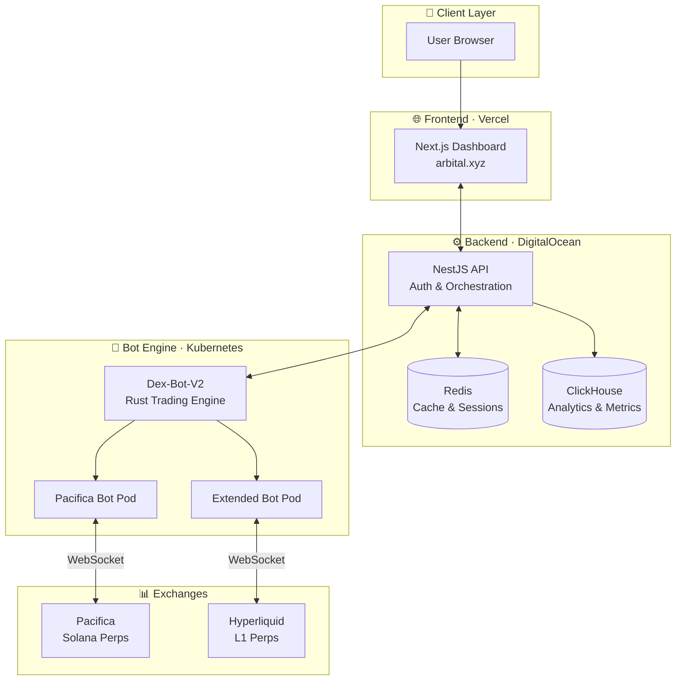
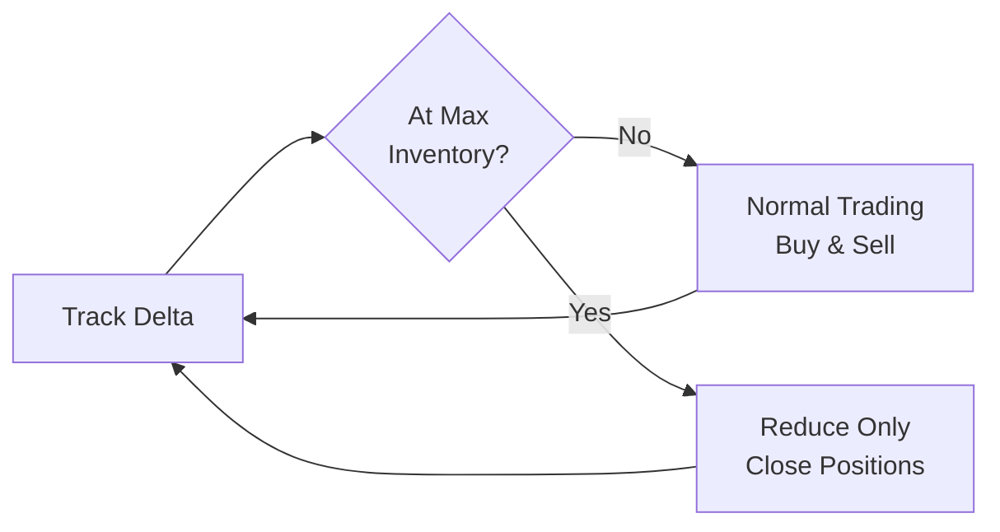

# How It Works

Arbital automates market-making strategies across perpetual DEXs, helping you earn trading rewards while managing risk.

## Why Use Arbital?

### The Problem

Perpetual DEXs need active market makers to provide tight spreads and deep order books. Historically, only professional firms with sophisticated infrastructure could participate — leaving exchanges with thin liquidity and traders with poor execution.

### The Solution

Arbital democratizes market making. By automating delta-neutral strategies, Arbital creates a win-win-win:

- **Exchanges** benefit from tighter pricing and higher liquidity
- **Traders** receive better execution with deeper order books
- **Market makers (you)** generate sustained trading volume and earn rewards

No quant background required. Configure a bot, deploy, and let Arbital's engine handle the rest.

## Who Is Arbital For?

Arbital is built for users who:

- **Want passive exposure to market making** — Earn from providing liquidity without building your own trading infrastructure
- **Want to farm points on perp DEXes** — Capture exchange incentive programs ($HYPE, $LIT, $ASTER) that reward active market makers
- **Don't want to actively trade** — Set up a bot once and let it run 24/7 with automated risk management
- **Prefer systematic, rules-based strategies** — No discretionary trading decisions; your bot follows the configuration you set

If you're looking for a hands-off way to participate in DeFi liquidity provision, Arbital handles the complexity so you can focus on strategy.

## The Core Loop

1. **Connect Wallet** — Link your EVM or Solana wallet
2. **Bind Credentials** — Securely link exchange API access via signature
3. **Configure Bot** — Choose strategy, bias, execution mode, and budget
4. **Bot Executes** — Continuously places orders based on your configuration
5. **Earn Rewards** — Collect trading fees, points, and exchange incentives

## Strategy Types

### TWAP Market Maker

**Time-Weighted Average Price** execution spreads your orders over time.

**How it works:**
- Splits your notional across buy and sell orders
- Adjusts order placement based on your bias setting
- Refreshes orders at intervals based on execution mode
- Auto-manages inventory to control exposure

**Best for:** Consistent execution, larger positions, stable markets

### Grid Market Maker

Places orders at fixed price intervals to profit from oscillation.

**How it works:**
- Creates a grid of buy orders below current price
- Creates a grid of sell orders above current price
- Profits when price oscillates between grid levels
- Stops when price hits boundary limits

**Best for:** Ranging markets, capturing small price movements

## Position Bias

Control your directional exposure:

| Bias | Strategy | Market View |
|------|----------|-------------|
| **-1 (Short)** | Prioritizes selling | Bearish, expect price drop |
| **0 (Neutral)** | 50/50 buy/sell | No directional view |
| **+1 (Long)** | Prioritizes buying | Bullish, expect price rise |


Bias affects **when** buys and sells happen — not **whether** they happen. The bot always places both buy and sell orders. Total volume converges over the full run. Margin requirements increase by up to 20% at higher bias levels.


## Bot Lifecycle

| State | Description | Actions Available |
|-------|-------------|-------------------|
| **Idle** | Created but never started | Start, Edit, Delete |
| **Pending** | Connecting to exchange | Wait |
| **Running** | Actively trading | Stop |
| **Stopping** | Canceling orders, closing | Wait |
| **Stopped** | Manually stopped | Start, Edit, Delete |
| **Completed** | Target reached | Delete, View Report |
| **Failed** | Error occurred | Restart, Edit, Delete |

## Architecture Overview

Arbital is built on a modern, scalable stack designed for high-frequency trading operations.

### Component Breakdown

| Layer | Technology | Purpose |
|-------|------------|---------|
| **Frontend** | Next.js 15, React 18 | User dashboard, bot management UI |
| **Backend** | NestJS 11 | API, authentication, bot orchestration |
| **Bot Engine** | Rust, Tokio | High-performance order execution |
| **Data** | ClickHouse, Redis | Analytics storage, session caching |
| **Infrastructure** | Vercel, K8s, DigitalOcean | Scalable cloud deployment |

### Data Flow

1. **User Actions** → Frontend sends requests to Backend API
2. **Bot Commands** → Backend orchestrates bot lifecycle via K8s
3. **Trade Execution** → Rust bots maintain WebSocket connections to exchanges
4. **Metrics** → Trading data streams to ClickHouse for analytics
5. **Real-time Updates** → Dashboard polls API for live bot status

## Non-Custodial Model

Arbital never holds your funds:

- **Your keys, your funds** — Assets stay in your exchange account
- **Credential binding** — API access linked via wallet signature, not stored keys
- **No withdrawal access** — Trading permissions only
- **Revoke anytime** — Unbind credentials from the dashboard

## Execution Modes

Control how responsive your bot is:

| Mode | Refresh Rate | Trade-off |
|------|--------------|-----------|
| **Aggressive** | Every 3 seconds | Maximum volume, higher slippage risk |
| **Normal** | Every 5 seconds | Best balance of volume and execution quality |
| **Passive** | Every 7 seconds | Best execution quality, lower costs |

- **Aggressive** is more prone to slippage and faster inventory accumulation during volatile conditions
- **Normal** offers the best balance between volume generation and execution quality — **recommended for most users**
- **Passive** prioritizes execution quality and fee efficiency over speed

## Incentive Opportunities

Perpetual DEXs actively reward market makers who contribute liquidity. Professional firms have historically earned six to eight figure rewards from these programs — Arbital gives you access to the same opportunity.

**Active incentive programs include:**

| Exchange | Incentive | Token |
|----------|-----------|-------|
| **Extended** | Points program + token rewards | $HYPE |
| **Pacifica** | Points farming program | $LIT |
| **Aster** | Early liquidity incentives | $ASTER |

Incentive structures vary by exchange and season. Check the [Exchanges Overview](../exchanges/overview.md) for current program details.

## Inventory Management

The bot automatically manages your position exposure:

1. **Tracks position delta** — Monitors buys vs. sells in USD
2. **Skews orders** — Adjusts bid/ask to naturally reduce inventory
3. **Enforces limits** — Stops adding to positions at max inventory
4. **Reduce-only mode** — Only closes positions when limits exceeded

This keeps your exposure controlled without manual intervention.

---

*Last updated: 2026-02-03*