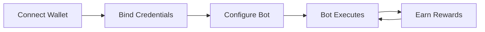
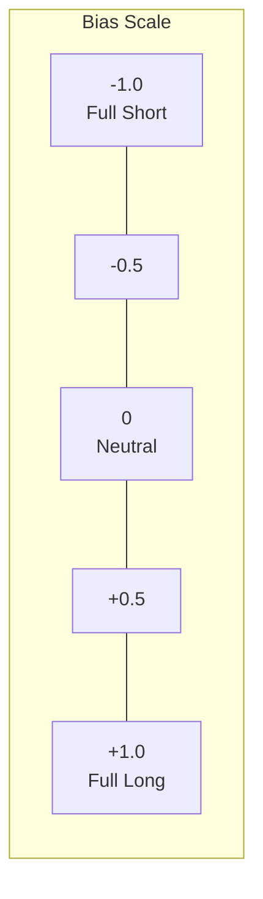
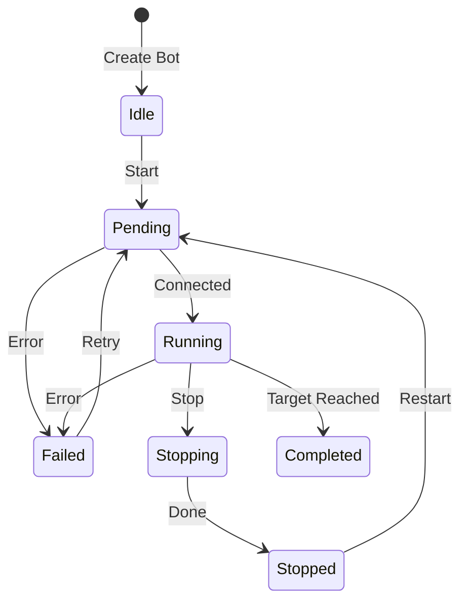
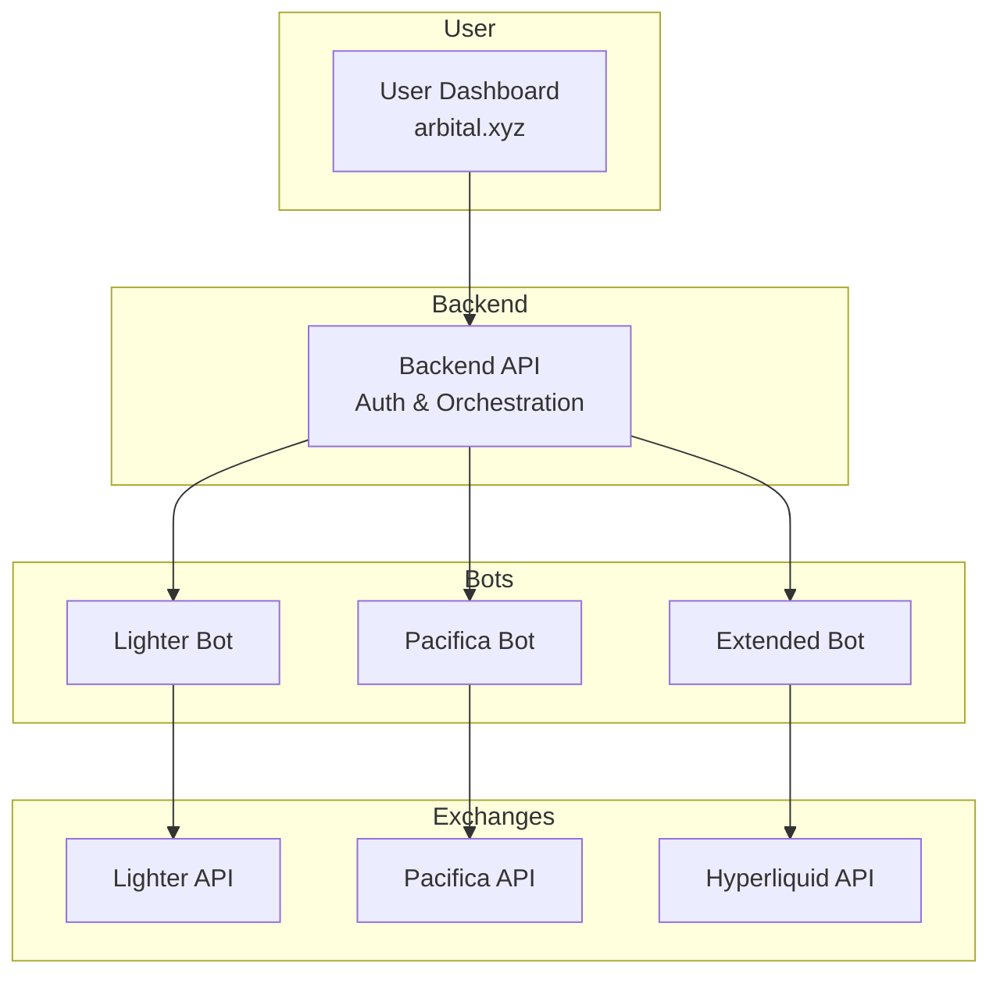
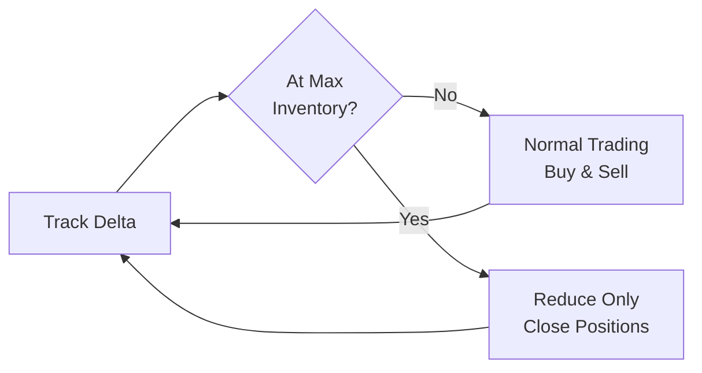

# How It Works

Arbital automates market-making strategies across perpetual DEXs, helping you earn trading rewards while managing risk.

## The Core Loop

1. **Connect Wallet** — Link your EVM or Solana wallet
2. **Bind Credentials** — Securely link exchange API access via signature
3. **Configure Bot** — Choose strategy, bias, execution mode, and budget
4. **Bot Executes** — Continuously places orders based on your configuration
5. **Earn Rewards** — Collect trading fees, points, and exchange incentives

## Strategy Types

### TWAP Market Maker

**Time-Weighted Average Price** execution spreads your orders over time.

**How it works:**
- Splits your notional across buy and sell orders
- Adjusts order placement based on your bias setting
- Refreshes orders at intervals based on execution mode
- Auto-manages inventory to control exposure

**Best for:** Consistent execution, larger positions, stable markets

### Grid Market Maker

Places orders at fixed price intervals to profit from oscillation.

**How it works:**
- Creates a grid of buy orders below current price
- Creates a grid of sell orders above current price
- Profits when price oscillates between grid levels
- Stops when price hits boundary limits

**Best for:** Ranging markets, capturing small price movements

## Position Bias

Control your directional exposure:

| Bias | Strategy | Market View |
|------|----------|-------------|
| **-1 (Short)** | Only sell orders | Bearish, expect price drop |
| **0 (Neutral)** | 50/50 buy/sell | No directional view |
| **+1 (Long)** | Only buy orders | Bullish, expect price rise |

## Bot Lifecycle

| State | Description | Actions Available |
|-------|-------------|-------------------|
| **Idle** | Created but never started | Start, Edit, Delete |
| **Pending** | Connecting to exchange | Wait |
| **Running** | Actively trading | Stop |
| **Stopping** | Canceling orders, closing | Wait |
| **Stopped** | Manually stopped | Start, Edit, Delete |
| **Completed** | Target reached | Delete, View Report |
| **Failed** | Error occurred | Restart, Edit, Delete |

## Architecture Overview

## Non-Custodial Model

Arbital never holds your funds:

- **Your keys, your funds** — Assets stay in your exchange account
- **Credential binding** — API access linked via wallet signature, not stored keys
- **No withdrawal access** — Trading permissions only
- **Revoke anytime** — Unbind credentials from the dashboard

## Execution Modes

Control how responsive your bot is:

| Mode | Refresh Rate | Trade-off |
|------|--------------|-----------|
| **Aggressive** | Every 3 seconds | Fastest response, higher costs |
| **Normal** | Every 5 seconds | Balanced approach |
| **Passive** | Every 7 seconds | Slower response, lower costs |

## Inventory Management

The bot automatically manages your position exposure:

1. **Tracks position delta** — Monitors buys vs. sells in USD
2. **Skews orders** — Adjusts bid/ask to naturally reduce inventory
3. **Enforces limits** — Stops adding to positions at max inventory
4. **Reduce-only mode** — Only closes positions when limits exceeded

This keeps your exposure controlled without manual intervention.

---

*Last updated: 2026-02-02*
