# Key Concepts

Essential terminology for using Arbital effectively.


**Looking for more terms?** See the full [Glossary](../reference/glossary.md) for 50+ definitions.


## Delta-Neutral

A trading strategy where the portfolio's total delta (directional exposure) equals zero. Price movements don't affect your P&L — you earn from other sources like funding rates and spreads.

```mermaid
flowchart TB
    subgraph Portfolio["Delta-Neutral Portfolio"]
        direction LR
        L["🟢 Long Position<br/>+$1,000"]
        S["🔴 Short Position<br/>-$1,000"]
    end

    subgraph Result["Net Exposure"]
        D["Delta = $0<br/>Market Neutral"]
    end

    subgraph Profit["Profit Sources"]
        F[Funding Rates]
        SP[Bid-Ask Spread]
        R[Exchange Rewards]
    end

    L --> D
    S --> D
    D --> Profit

    style L fill:#22c55e,color:#fff
    style S fill:#ef4444,color:#fff
    style D fill:#3b82f6,color:#fff
```

**Key Benefit:** Whether the market goes up or down, your portfolio value stays stable while you earn from trading activity.

## Perpetual Futures (Perps)

Derivative contracts with no expiration date. They track the price of an underlying asset and use funding rates to stay aligned with spot prices.

## Funding Rate

Periodic payments between long and short traders on perp exchanges. When funding is positive, longs pay shorts. When negative, shorts pay longs.

## Market Making

Providing liquidity by placing both buy and sell orders. Market makers earn the spread between bid and ask prices.

## Spread

The difference between the best bid (buy) and ask (sell) prices. Tighter spreads = more competitive market.

## Rebalancing

Adjusting positions to maintain target allocations or delta-neutrality. Arbital bots auto-rebalance based on your configured thresholds.

## Slippage

The difference between expected and actual execution price. Larger orders typically experience more slippage.

## Collateral

Assets deposited as margin for trading. Required to open and maintain positions on perp exchanges.

---

*Last updated: 2026-02-02*
