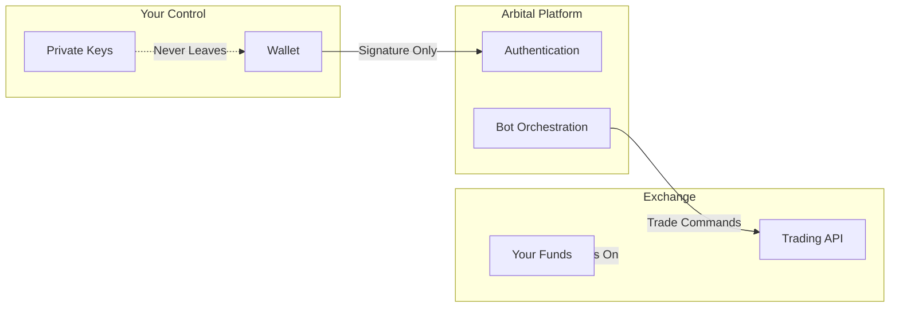
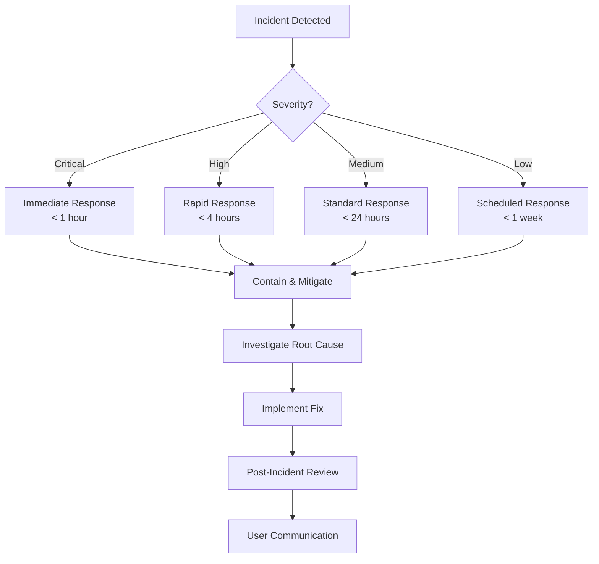

# Security & Transparency

Arbital is committed to security transparency. This page documents our security architecture, audit status, and incident response procedures.

---

## Security Architecture

### Non-Custodial Design

Arbital operates on a **fully non-custodial model**:

| Security Property | Implementation |
|-------------------|----------------|
| **No key storage** | Private keys never leave your wallet |
| **No fund custody** | Assets remain on the exchange |
| **Trading only** | No withdrawal permissions granted |
| **Revocable access** | Unbind credentials anytime |

### Authentication Security

- **EIP-712 Typed Data Signing** — Structured, readable signatures for EVM wallets
- **Solana Message Signing** — Standard Solana signature flow
- **Timestamp Binding** — Signatures include timestamps to prevent replay attacks
- **Session Management** — Secure, encrypted session tokens

### Infrastructure Security

| Layer | Security Measures |
|-------|-------------------|
| **Frontend** | HTTPS only, CSP headers, XSS protection |
| **Backend** | Rate limiting, input validation, encrypted at rest |
| **Bot Engine** | Isolated containers, no persistent credentials |
| **Database** | Encrypted, access-controlled, regular backups |

---

## Audit Status

### Smart Contract Audits


**Status: Pending**

Arbital does not deploy its own smart contracts. We integrate with third-party exchanges (Lighter, Pacifica, Hyperliquid) that have their own audit histories.

When Arbital deploys on-chain components, this section will be updated with audit reports.


### Exchange Audit References

| Exchange | Audit Status | Reference |
|----------|--------------|-----------|
| **Lighter** | Audited | See Lighter documentation |
| **Pacifica** | Audited | See Pacifica documentation |
| **Hyperliquid** | Audited | See Hyperliquid documentation |

### Platform Security Review

| Component | Status | Last Review |
|-----------|--------|-------------|
| Authentication Flow | ✅ Internal Review | 2025-12 |
| API Security | ✅ Internal Review | 2025-12 |
| Bot Engine | ✅ Internal Review | 2026-01 |
| External Audit | 🔄 Planned | TBD |

---

## Bug Bounty Program


**Status: Coming Soon**

We are establishing a bug bounty program to reward security researchers who responsibly disclose vulnerabilities.

Interested in participating? Contact us at **security@arbital.xyz** (coming soon).


### Scope (Planned)

When launched, the program will cover:

- Authentication bypass
- Unauthorized access to user data
- Bot manipulation vulnerabilities
- API security issues

### Out of Scope

- Third-party exchange vulnerabilities (report to respective exchanges)
- Social engineering attacks
- Physical attacks
- Denial of service

---

## Incident Response

### Response Process

### Severity Levels

| Level | Description | Response Time |
|-------|-------------|---------------|
| **Critical** | Active exploitation, fund risk | < 1 hour |
| **High** | Significant vulnerability, no active exploit | < 4 hours |
| **Medium** | Limited impact vulnerability | < 24 hours |
| **Low** | Minor issue, no user impact | < 1 week |

### Communication Policy

In the event of a security incident:

1. **Immediate:** Affected users notified directly (if identifiable)
2. **24 hours:** Public status update on arbital.xyz
3. **Post-incident:** Full transparency report published

---

## Responsible Disclosure

If you discover a security vulnerability:

1. **Do not** publicly disclose the vulnerability
2. **Do not** exploit the vulnerability beyond verification
3. **Contact us** at security@arbital.xyz (coming soon)
4. **Provide** detailed information to help us reproduce the issue
5. **Allow** reasonable time for us to address the issue

We commit to:
- Acknowledging receipt within 24 hours
- Providing regular updates on remediation progress
- Crediting researchers (with permission) in our security acknowledgments

---

## Security Best Practices for Users

See our [Security Best Practices Guide](../guides/security.md) for:
- Wallet security tips
- Credential management
- Safe trading practices
- Recognizing phishing attempts

---

## Contact

For security-related inquiries:

- **Email:** security@arbital.xyz (coming soon)
- **Response Time:** < 24 hours for security reports

For general support, see [Need Help?](../README.md#need-help)

---

*Last updated: 2026-02-03*
